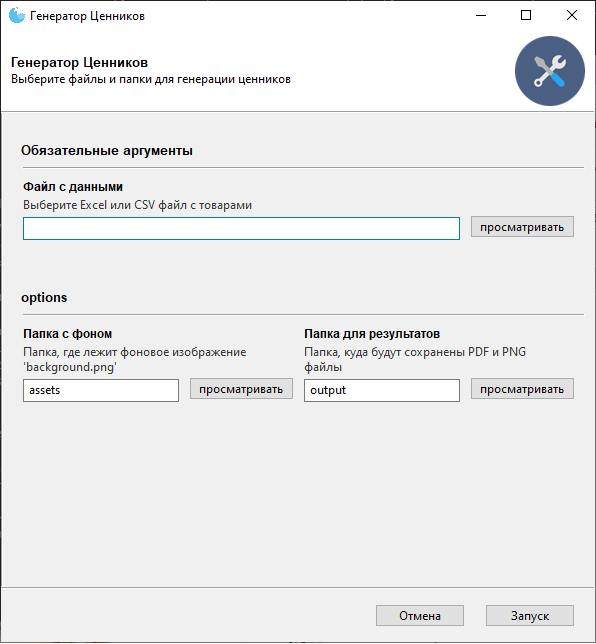

1
2(title.jpg)

Этот инструмент представляет собой скрипт на Python для автоматической генерации ценников из Excel/CSV файла. Он автоматически располагает ценники на листах формата А4 и А3 для максимального заполнения и экспортирует результат в PDF, а также каждый ценник в отдельный PNG файл.

---

## 🚀 Как использовать

### 1. Подготовка
Перед первым запуском убедитесь, что у вас установлен **Python** (версия 3.8 или новее).

### 2. Установка зависимостей
Откройте терминал или командную строку в папке проекта и выполните следующую команду, чтобы установить все необходимые библиотеки:
```bash
pip install -r requirements.txt
```

### 3. Заполнение данных
- **`data.csv`**: Откройте этот файл и заполните его вашими товарами. Колонки соответствуют данным на ценнике (название, цены, вес, КБЖУ).
- **`assets/background.png`**: В эту папку поместите фоновое изображение для ваших ценников. Рекомендуемый размер: **945x531 пикселей** для наилучшего качества.

### 4. Запуск скрипта
Для генерации ценников выполните в терминале следующую команду:
```bash
python main.py
```

### 5. Результат
Все готовые файлы вы найдете в папке `output`:
- **`output/*.pdf`**: PDF-файлы с оптимально расположенными ценниками на листах A4 и A3.
- **`output/png/*.png`**: Отдельные PNG-файлы для каждого ценника.

---

## 📂 Структура проекта

```
.
├── assets/
│   └── background.png    # Фоновое изображение для ценника (945x531 px)
│
├── output/
│   ├── png/              # Папка для сгенерированных PNG файлов
│   ├── price_tags_A3.pdf # Готовый PDF для печати на A3
│   └── price_tags_A4.pdf # Готовый PDF для печати на A4
│
├── data.csv              # Исходный файл с данными по товарам
├── main.py               # Основной скрипт для запуска
├── requirements.txt      # Список зависимостей для Python
├── task.md               # Исходное описание задачи
└── tech_task.md          # Техническое задание
```
